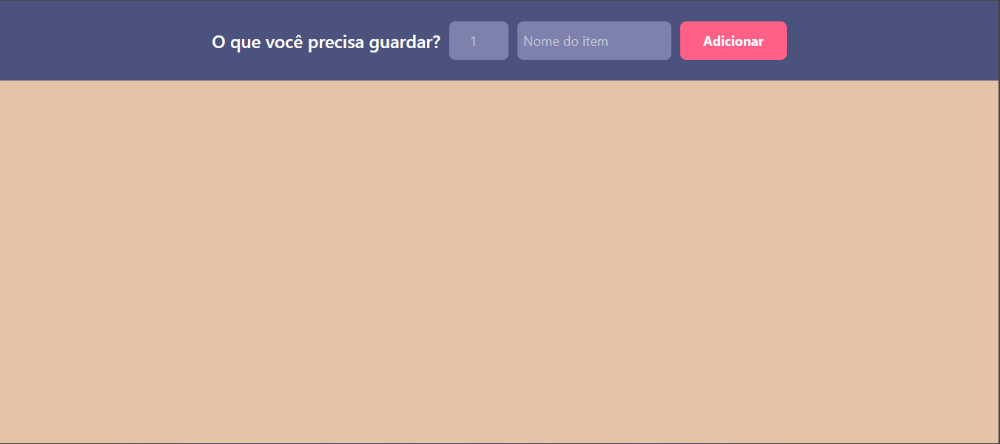
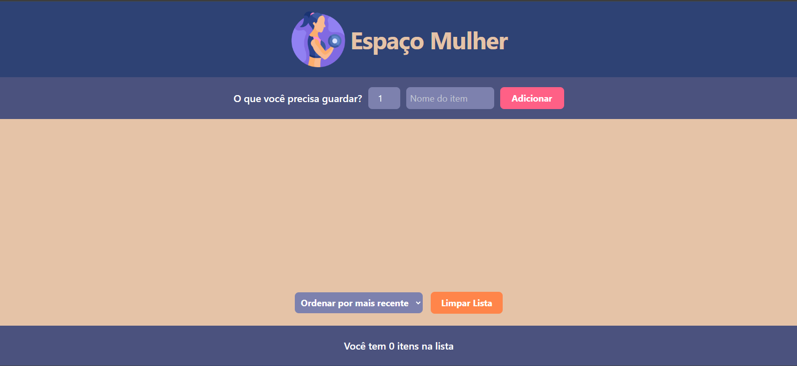

# 1° projeto PPPR

Este projeto foi o primeiro desenvolvido durante o curso de react do Roger Melo

Ideia do projeto: A ideia foi entregar um projeto que resolvesse o problema da cliente em 24h

Problema:
A cliente possuí uma academia e todo dia precisava se lembrar do que guardar
Ela já possuía o layout da aplicação que ajudaria ela nisso

Implementação:

- React (vite)
- Tailwindcss
- Vercel

Primeiro deploy
Escolhi fazer a primeira entrega somente do mínimo para resolver o problema

- [x] Form para cadastrar items
- [x] Lista dos items
- [x] Botão para marcar como guardado
- [x] Botão para remover item da lista
      

Depois do primeiro deploy implementei as demais funções e estilizações

- [x] Header e favicon
- [x] Footer com contador dinâmico
- [x] Botão para limpar lista
- [x] Botão para ordenar / filtrar a lista
  - [x] Por data
  - [x] Ordem alfabética
  - [x] Somente já guardados
  - [x] Somente não guardados
        
